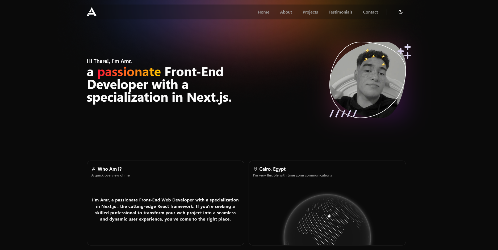

# Personal Portfolio

Welcome to my personal portfolio! This portfolio is a reflection of my journey as a **front-end developer**, showcasing my skills, projects, and professional experiences. Built with cutting-edge technologies like **Next.js**, **TypeScript**, **Tailwind CSS**, and **Shadcn UI**, this site highlights my passion for creating sleek, responsive, and user-friendly web applications.

[](https://amr-portfolio-dev.vercel.app/)

## Live Demo

Check out the live version of the portfolio [here](https://amr-portfolio-dev.vercel.app/).

## Table of Contents

- [Features](#features)
- [Tech Stack](#tech-stack)
- [Getting Started](#getting-started)
- [Contributing](#contributing)
- [Contact](#contact)

## Features

- **Responsive Design:** Optimized for both desktop and mobile devices.
- **Modern UI/UX:** Sleek design with smooth transitions, making use of Shadcn UI components.
- **SEO Optimized:** Built-in SEO enhancements for better visibility on search engines.
- **Deployed on Vercel:** Quick and easy deployment on Vercel with automatic scaling.

## Tech Stack

- **Framework:** [Next.js 14](https://nextjs.org/)
- **Language:** [TypeScript](https://www.typescriptlang.org/)
- **Styling:** [Tailwind CSS](https://tailwindcss.com/)
- **UI Components:** [Shadcn UI](https://shadcn.dev/)
- **Deployment:** [Vercel](https://vercel.com/)

## Getting Started

To get a local copy of the project up and running, follow these steps:

### Installation

1. **Clone the repository:**

   ```bash
   git clone https://github.com/amr12338kh/nextjs-portfolio.git

2. **Navigate into the project directory:**

   ```bash
   cd nextjs-portfolio

3. **Install dependencies:**

   ```bash
   npm install
   # or
   yarn install

4. **Open your browser and visit:**

   ```bash
   http://localhost:3000

## Contributing

Contributions are welcome! If you have suggestions or improvements, feel free to fork the repository and create a pull request.

1. **Fork the repository**
2. **Create your feature branch:**

   ```bash
   git checkout -b feature/AmazingFeature
   
3. **Commit your changes:**

   ```bash
   git commit -m 'Add some AmazingFeature'

4. **Push to the branch:**

   ```bash
   git push origin feature/AmazingFeature

5. **Open a pull request**

## Contact

Feel free to reach out if you have any questions or suggestions!

- **Portfolio:** [amr-portfolio-dev.vercel.app](https://amr-portfolio-dev.vercel.app/)
- **GitHub:** [@amr12338kh](https://github.com/amr12338kh)
- **Email:** amrkhaled12338@gmail.com
